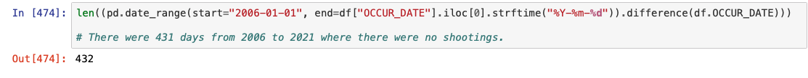

# NYCShootings
For a dynamic view of this Jupyter Notebok please visit: http://nbviewer.org/github/brandonbracho/NYCShootings/blob/main/ShootingsNYC%281%29.ipynb
# Introduction 
This project is part EDA (Exploratory Data Analysis) and part predcitive modeling using the Historic Shooting Incidents and Year to Date Shooting Incidents dataset from NYC's Open Data site. Inspiration for this project ensued in light of the media frenzy that is surrounding the rise of gun violence in New York City. Do the numbers match the hype? Questions that are addressed within the project include:
- What are the overall trends in shootings, along with yearly, monthly and hours trends.
- What factors play a role in the sheer number of daily shootings and could these factors help a preditive model perform better?
- Where do most shootings in NYC occur?
- What are trends seen in the demographics of perpetrators of shootings along with the victims?
- How many total shootings might NYC see in the year of 2021?
# Packages and Resources Used
- **Python Version:** 3.7
- **Packages/Modules:** pandas, numpy, sklearn, folium, datetime, matplotlib, seaborn
- **Data Sources:** https://data.cityofnewyork.us/Public-Safety/NYPD-Shooting-Incident-Data-Historic-/833y-fsy8 (Historic Shootings), https://data.cityofnewyork.us/Public-Safety/NYPD-Shooting-Incident-Data-Year-To-Date-/5ucz-vwe8 (YTD Shootings), https://www.wunderground.com/ (Historical Weather Data)
- **Papers Cited:** Reeping, Paul M, and David Hemenway. “The association between weather and the number of daily shootings in Chicago (2012-2016).” Injury epidemiology vol. 7,1 31. 22 Jun. 2020, doi:10.1186/s40621-020-00260-3 https://www.ncbi.nlm.nih.gov/pmc/articles/PMC7310019/
# Relevant Findings
## Overview of Dataset

[^1]
 
[^2]

[^3]

[^4]

[^1]: First five rows of data are being printed. 
[^2]: The dataset type is being shown here along with the count of non-null values. The dataset is composed of mixed types with the majority being strings. 
[^3]: The dataset is composed of 24470 rows and 18 columns. 
[^4]: The dataset is contains very little missing data overall, with every column having under 1% of data being composed of missing values. 

## Time Series Aggregations of Shootings 

[^5]

[^6]

[^7]

[^8]

[^9]

[^10]

[^11]

[^12]

[^5]: There were a total of 432 days without shootings in NYC between the years of 2006 - 2021.
[^6]: Boxplot of distribution of number of shootings per day. 
[^7]: KDE distribution plot of shootings per day.
[^8]: Creation of time-dependent features, such as Year, Hour, and Month. 
[^9]: Total shootings aggregated by day of week. 
[^10]: Total shootings aggregated by hour.
[^11]: Total shootings aggreagted by year.
[^12]: Total shootings aggregated by month.

## Geographical Mapping of Shootings

[^13]

[^14]

[^13]: Heatmap showing concentration of shooting incidents across the five boroughs. 
[^14]: Cluster map showing total number of shootings within a certain area. Visit http://nbviewer.org/github/brandonbracho/NYCShootings/blob/main/ShootingsNYC%281%29.ipynb for the interactive version of these maps.

## Shooting Trends Among the Years

[^15]

[^16]

[^17]

[^18]

[^15]: Trends for the last 4 years plotted. 2021 is seeing more of a linear increase in shootings when compared to 2020 that saw exponential growth in the summer months. 
[^16]: The amount of shootings up to June, 30th show that 2021 is on pace to be NYC's most violent year since before 2006. 
[^17]: This dataframe shows the difference in shootings on a day-to-day basis when comparing 2020 to 2021.
[^18]: The graphed representation of year-on-year percentage growth in number of shootings. 

## Model Building/Predciting Total Number of Shootings in 2021

[^19]

[^20]

[^21]

[^22]

[^23]

[^24]

[^25]

[^19]: A column depicting whether or not a day falls on a holiday is made. Using the results from, Reeping, Paul M, and David Hemenway (2020) along with a comparison of the average number of shootings on days that fall on holidays vs days that do not fall on holidays led me to include this in the feature space for the model. 
[^20]: Along with the previos feature, the average temperature of a day will be included in the feature space. Citing Reeping, Paul M, and David Hemenway (2020) once again, there appears to be a positive correlation between the number of shootings in a given day and the average temperature. 
[^21]: Dataframe imported from CSV file that was produced by the Historical Weather Web Scraper. 
[^22]: The final dataframe that will be used to train and test our model. 
[^23]: Using a Gradient Boosting Regressor from sklearn, the model is fitted using GridSearchCV to find the best parameters. The R^2 score is approximately .40
[^24]: The predicted number of cumalative shootings in 2021 is about 1536.
[^25]: The plot showing the trajectory of actual shootings in 2021, appended to the predicted shootings after June 30th. 

## Murders From Shootings 

[^26]

[^27]

[^28]

[^29]

[^30]

[^31]

[^32]

[^26]: The total number of murders from shootings from 2006 to June 30th of 2021 were 4670.
[^27]: Percentage of victims from shootings who died aggregated by year.
[^28]: Graphical representation of the previous iamge. 
[^29]: Total murders aggregated by day of the week.
[^30]: Total murders aggregated by the month of the year. 
[^31]: Total murders aggregated by year.
[^32]: Murders up top June 30th, aggregated by year. 2021 is on pace to be one of the deadliest years seen since 2006. 

## Location 

[^33]

[^34]

[^35]

[^36]

[^33]: Total number of shootings by NYC borough. 
[^34]: Shootings per capita by NYC borough. 
[^35]: Total number of shootings by type of location.
[^36]: Deaths per shooting by location.

## Demographics 

[^37]

[^38]

[^39]

[^40]

[^41]

[^42]

[^37]: Pie chart breakdown of age for perpetrators of shootings. 
[^38]: Pie chart breakdown of race for perpetrators of shootings. 
[^39]: Pie chart breakdown of sex for perpetrators of shootings.
[^40]: Contingency table for age of perpetrators vs age of victims of shootings. Contingency is based off ratios within each row. 
[^41]: Contingency table for race of prepetrators vs race of vicitims of shootings. Top breakdown are actual numbers while the bottom table is based off ratios.
[^42]: Contingency table for the sex of prepetrators vs sex of victims of shootings. Top breakdown are actual numbers while the bottom table is based off ratios.

